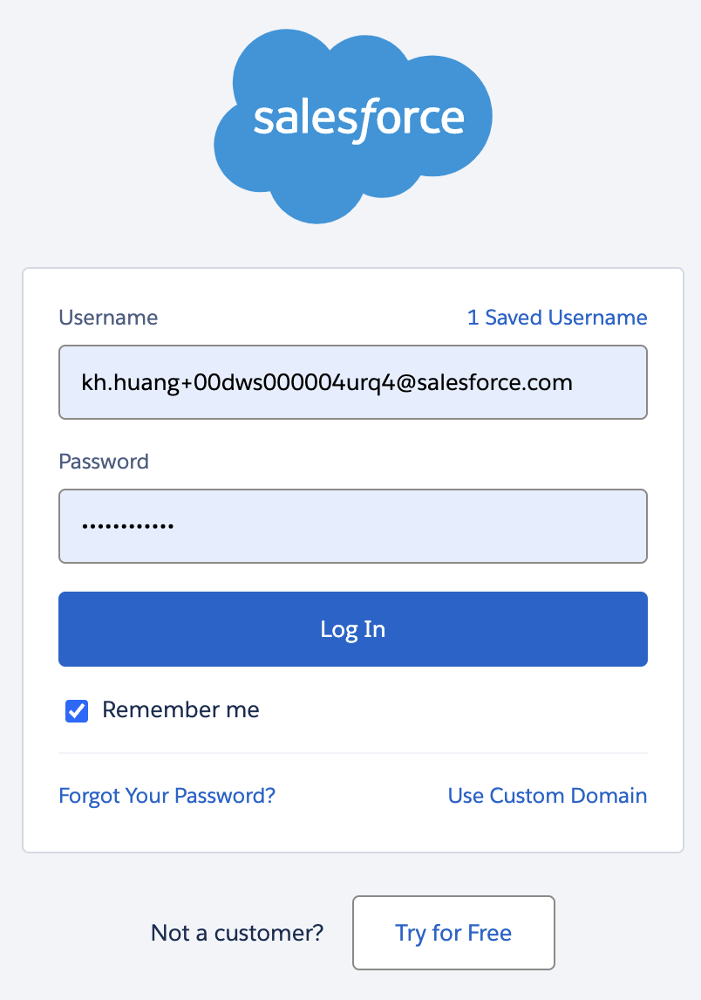

# CRMArena

<div align="center">
<a href="https://arxiv.org/abs/2505.18878"></a>
</div>


<div align="center">
<strong>Salesforce AI Research</strong>
</div>
This repo contains the evaluation code for the paper "<a href="https://arxiv.org/abs/2505.18878">CRMArena-Pro: Holistic Assessment of LLM Agents Across Diverse Business Scenarios and Interactions</a>" and "<a href="https://arxiv.org/abs/2411.02305">CRMArena: Understanding the Capacity of LLM Agents to Perform Professional CRM Tasks in Realistic Environments</a>"
<hr>


### 📚 CRMArena
<a href='https://arxiv.org/abs/2411.02305'></a>
<a href='https://huggingface.co/datasets/Salesforce/CRMArena'></a>
<a href='https://huggingface.co/spaces/Salesforce/CRMArena-Leaderboard'></a>

### 🚀 CRMArena-Pro
<a href='https://arxiv.org/abs/2505.18878'></a>
<a href='https://huggingface.co/datasets/Salesforce/CRMArenaPro'></a>


<!-- Common License -->
<a href='https://github.com/SalesforceAIResearch/CRMArena/blob/main/LICENSE.txt'></a>


## 🔔News

- **🌟 [2025-05] Introducing [CRMArena-Pro](https://arxiv.org/abs/2505.18878) - a major expansion of the original CRMArena featuring enhanced support for diverse business applications, industry types, and interactive scenarios! 🚀**
- **🎉 [2024-01] CRMArena has been accepted by NAACL 2025!**


**Note: This repository is for research purposes only and not for commerical.**


## Quickstart

```bash
pip install -e .
```

To access our org, use the following credentials. 

```bash
# the original CRMArena
SALESFORCE_USERNAME=kh.huang+00dws000004urq4@salesforce.com
SALESFORCE_PASSWORD=crmarenatest
SALESFORCE_SECURITY_TOKEN=ugvBSBv0ArI7dayfqUY0wMGu

# CRMArena-Pro B2B
SALESFORCE_B2B_USERNAME=crmarena_b2b@gmaill.com
SALESFORCE_B2B_PASSWORD=crmarenatest
SALESFORCE_B2B_SECURITY_TOKEN=zdaqqSYBEQTjjLuq0zLUHkC3

# CRMArena-Pro B2C
SALESFORCE_B2C_USERNAME=crmarena_b2c@gmaill.com
SALESFORCE_B2C_PASSWORD=crmarenatest
SALESFORCE_B2C_SECURITY_TOKEN=2AQCtK8MnnV4lJdRNF0DGCs1
```

### Accessing the Org via GUI

To access the GUI of our Org, follow the steps below:

1. Head to https://login.salesforce.com/.
2. Type in the user name and password using the above credentials.
<div align="center">
<a href="https://pluslabnlp.github.io/"></a>
</div>

3. You can now see the GUI of our Org.


### Accessing the Org via API

First, create a `.env` file by copying from `.env.example` which already contains the credentials for the Org.

```bash
cp .env.example .env
```

Then, store your Salesforce org / OpenAI / AWS Bedrock / TogetherAI API keys in `.env`
```bash
OPENAI_API_KEY=...
...
```

After that, you can use Simple Salesforce to connect to our Org.

```python
from simple_salesforce import Salesforce
import os

sf = Salesforce(username=os.getenv("SALESFORCE_USERNAME"), password=os.getenv("SALESFORCE_PASSWORD"), security_token=os.getenv("SALESFORCE_SECURITY_TOKEN"))

sf.query.query_all(...)
```


## Running experiments

To run experiments, you first need to ensure that the necessary data is available. The data is loaded from Hugging Face datasets "Salesforce/CRMArena" and "Salesforce/CRMArenaPro" as defined in `crm_sandbox/data/assets.py`.

```python
from datasets import load_dataset

# Original CRMArena data
crmarena_queries = load_dataset("Salesforce/CRMArena", "CRMArena")
crmarena_schema = load_dataset("Salesforce/CRMArena", "schema")

# CRMArena-Pro data
crmarena_pro_queries = load_dataset("Salesforce/CRMArenaPro", "CRMArenaPro")
b2b_schema = load_dataset("Salesforce/CRMArenaPro", "b2b_schema")
b2c_schema = load_dataset("Salesforce/CRMArenaPro", "b2c_schema")
```
For more details on data loading and structure, please refer to `crm_sandbox/data/assets.py`.

We have prepared evaluation scripts to simplify the process of running experiments.

### Running CRMArena Experiments

To run experiments for the original CRMArena:
1. Configure your desired settings (agent models, tasks, strategies, etc.) in `run_tasks_crmarena.sh`.
2. Launch the experiments using the following command:

```bash
bash run_tasks_crmarena.sh
```

### Running CRMArena-Pro Experiments

To run experiments for CRMArena-Pro:
1. Configure your desired settings (agent models, tasks, strategies, interactive mode, org type, etc.) in `run_tasks_crmarena_pro.sh`.
2. Launch the experiments using the following command:

```bash
bash run_tasks_crmarena_pro.sh
```

These scripts will execute `run_tasks.py` with the specified configurations and save the results and logs in appropriately named directories.


## Citation

If you find this work useful, please consider citing:

```bibtex
@inproceedings{huang-etal-2025-crmarena,
    title = "CRMArena: Understanding the Capacity of LLM Agents to Perform Professional CRM Tasks in Realistic Environments",
    author = "Huang, Kung-Hsiang  and
      Prabhakar, Akshara  and
      Dhawan, Sidharth  and
      Mao, Yixin  and
      Wang, Huan  and
      Savarese, Silvio  and
      Xiong, Caiming  and
      Laban, Philippe  and
      Wu, Chien-Sheng",
    booktitle = "Proceedings of the 2025 Conference of the Nations of the Americas Chapter of the Association for Computational Linguistics: Human Language Technologies (Volume 1: Long Papers)",
    year = "2025",
}

@article{huang-etal-2025-crmarena-pro,
    title = "CRMArena-Pro: Holistic Assessment of LLM Agents Across Diverse Business Scenarios and Interactions",
    author = "Huang, Kung-Hsiang  and
      Prabhakar, Akshara  and
      Thorat, Onkar  and
      Agarwal, Divyansh  and
      Choubey, Prafulla Kumar  and
      Mao, Yixin  and
      Savarese, Silvio  and
      Xiong, Caiming  and
      Wu, Chien-Sheng",
    journal = "arXiv preprint arXiv:2505.18878",
    year = "2025",
}
```

## Ethical Considerations
This release is for research purposes only in support of an academic paper. Our models, datasets, and code are not specifically designed or evaluated for all downstream purposes. We strongly recommend users evaluate and address potential concerns related to accuracy, safety, and fairness before deploying this model. We encourage users to consider the common limitations of AI, comply with applicable laws, and leverage best practices when selecting use cases, particularly for high-risk scenarios where errors or misuse could significantly impact people's lives, rights, or safety. For further guidance on use cases, refer to our AUP and AI AUP. 

